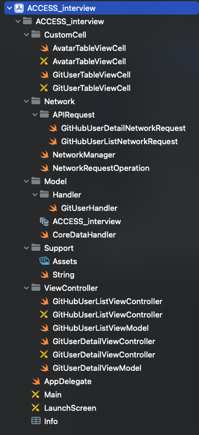
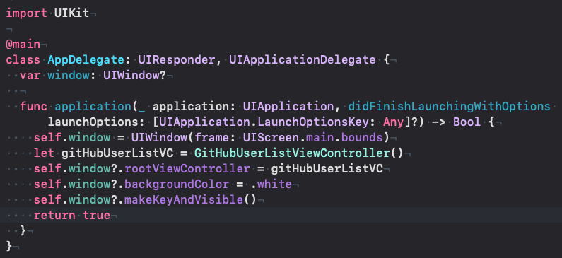
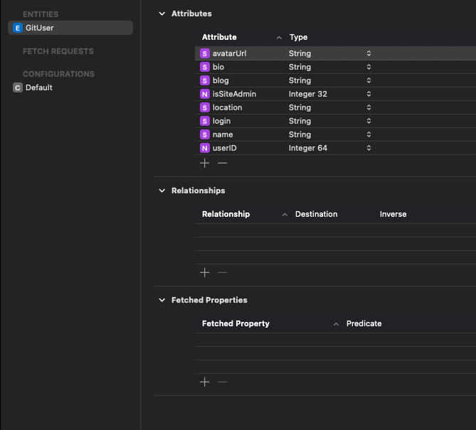
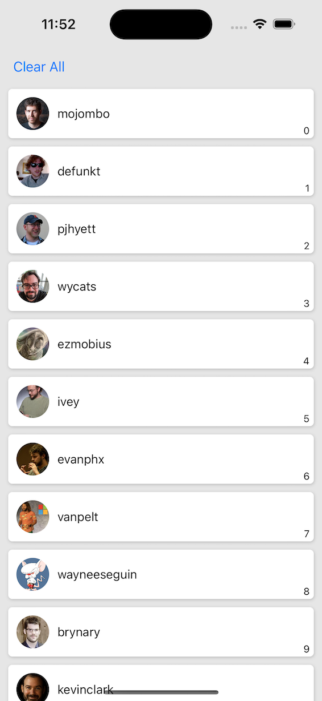
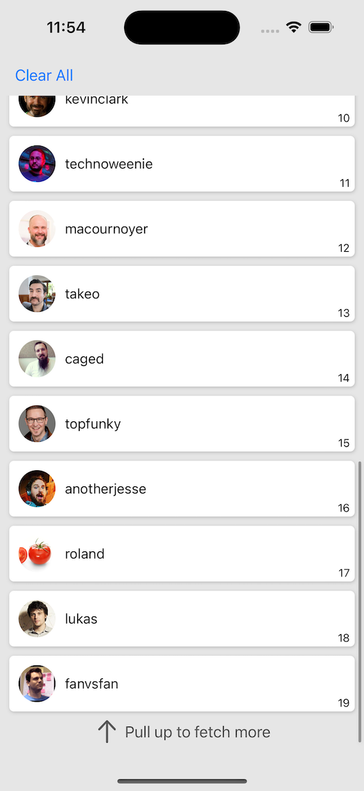
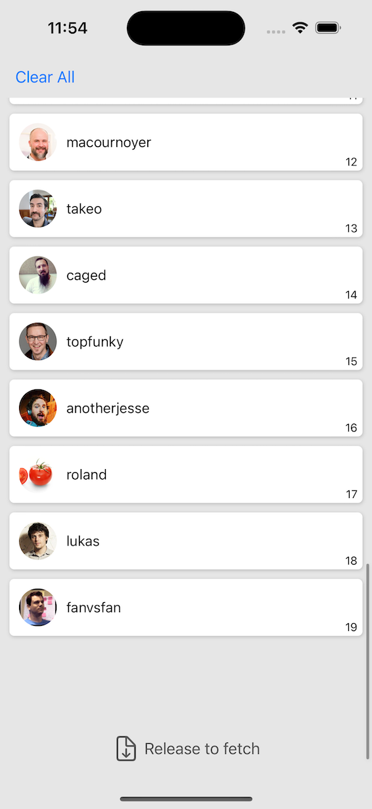
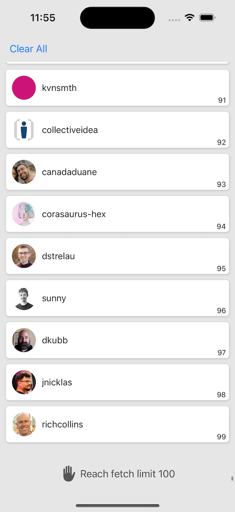
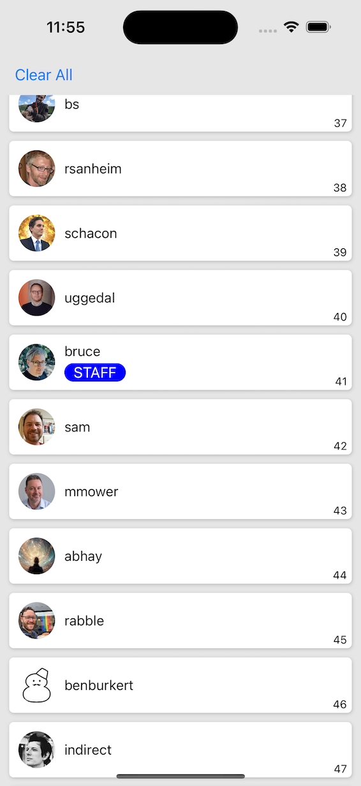
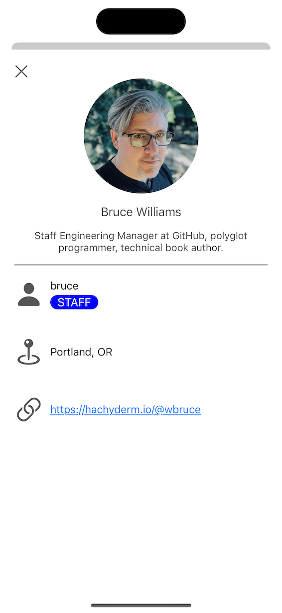
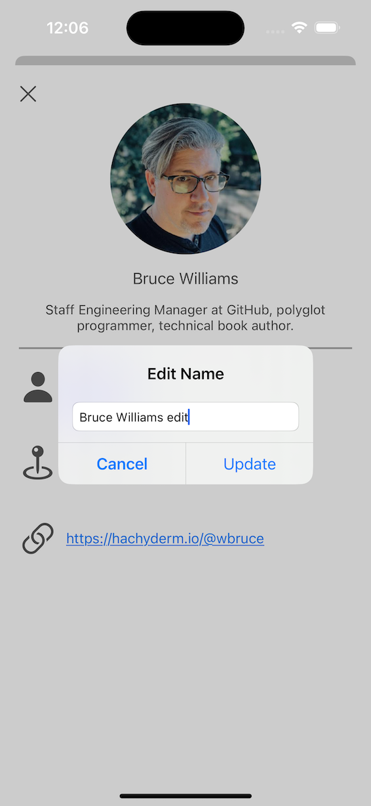

ACCESS_interview
======

愛可信面試考題 - 捷通軟體推薦

# Method
## Files

For all custom tableView cells will be placed in `CustomCell`. For Network asynchronize queue and APIs will be placed in `Network` and subgroup `APIRequest`. For Coredata database files will be placed at `Model` and subgroup `Handler`. For assistant files such as images or native object extensions will be placed in `Support`. Last but not least, all viewControllers and viewModels will be placed in the `ViewController` group.

For personal habits, I prefer not to use StoryBoard, so the `Main.storyboard` file can be ignored. Instead, I manually replace the rootViewController at AppDelegate.

## Model

In this demo project, I use Coredata as my model. First I create a `GitUser` entity with those usable attributes and use `NSFetchedResultsController` to help me update UI when target data has been changed without other multiple queries.

## Network
I've created an operation queue to process all API operations in `NetworkManager.swift`. And basic operation `NetworkRequestOperation.swift` contains URLSessionTask methods and error handling. But in this demo I just prints some error message.

As for APIs, each API has to implement `NetworkRequestOperation` and override 'success' and 'failure' functions for different purposes.

> Hint: API accessToken use in GitHub API is available for **30** days since **2023/03/14**

## ViewController
### User list page
As the requirement asked, this page needs to show 20 users per page and 100 maximum, needs to show a user avatar, login name, a 'STAFF' badge if this user is a site admin and number of items.

Steps:
1. Create tableView cell `GitUserTableViewCell.swift`.
1. Place a tableView component into xib and set a constraint for revealing user list.
1. Place a toolbar component into xib and set a constraint for reset data purposes.
1. Add `GitHubUserListViewModel.swift` to manage database and network logic.
1. Make sure the first 20 users' data is correct and the UI is fluent enough.
1. Customize tableView pull-up distance to achieve paginated function.
1. Make sure user data count from 0 to 100 is all correct and the UI is fluent enough.

### User detail page
As the requirement asked, this page needs to show the user detail which is selected on the list page, and the real name is editable.

Steps:
1. Create tableView cell `AvatarTableViewCell.swift` for a special appearance and reuse `GitUserTableViewCell.swift` for the same structure as the list cell.
1. Place tableView component into xib and set constraint for revealing data.
1. Place button component into xib and set constraint for dismissing this page.
1. Add `GitUserDetailViewModel.swift` to manage database and network logic.
1. Will automatically fetch user data and update UI if there are no real name in database after checking.
1. Make sure the user detail is correct and won't be queried twice if already have the name in case override the edited new name.
1. Implement a blog url attributed string that can be opened by a default web browser with one tap.
1. Implement UIAlertController for the edit name function.
1. Make sure the user's new name is successfully updated and update UI.

# Demo & Remark
* Once the app has been opened, it will show the data saved in the local database. If there are no data, it will automatically fetch the first 20 users from GitHub API.  

* You can click “Clear All” to wipe out all data that store in the local database. Press “Re-initial” can fetch the first 20 users again.  

* For the paginated function, you can keep pulling up at the bottom of the list, you will see the hint. There are three states, keep pulling up, release to fetch, and reach the fetch limit.  
  
  

* As the requirement asked, need to show the badge if this user is a site admin.  

* When pressing on any user on the list, it will bring up and show all user detail that was asked in the requirement. You can click on the blog URL, it will bring up a default web browser and show url content.  

* Press on the user’s name, and it will pop up a system alert input view for the edit name requirement.  

* If click update and the name did change, it will update the database and refresh UI.  

